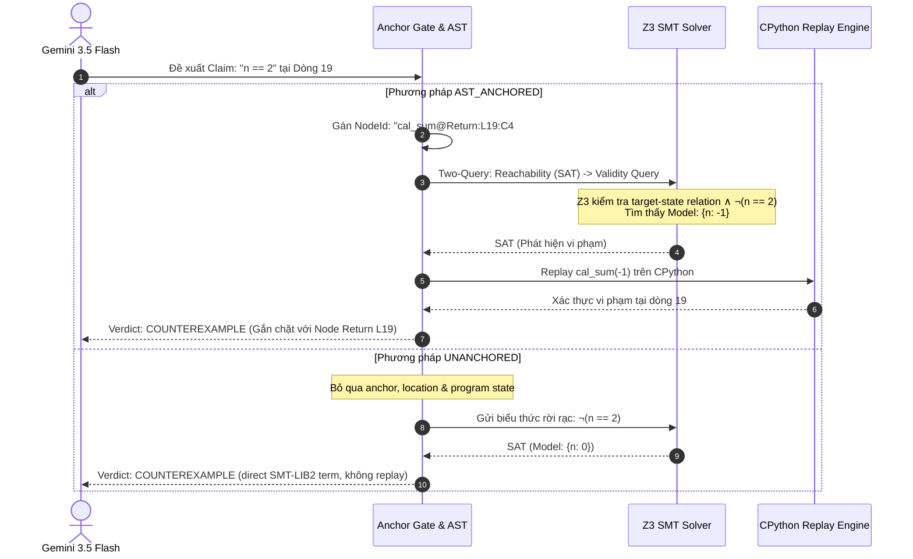

# BÁO CÁO NGHIÊN CỨU ĐIỂN HÌNH (CASE STUDY REPORT)
# PHÂN TÍCH QUÁ TRÌNH SUY LUẬN CHAIN-OF-THOUGHT CỦA LLM VÀ VAI TRÒ CỦA CÂY CÚ PHÁP TRỪU TƯỢNG (AST) TRONG KIỂM CHỨNG HÌNH THỨC CHƯƠNG TRÌNH

> **Audit correction.** Đây là kết quả lịch sử. Không được đọc các verdict
> cũ như chứng minh soundness toàn chương trình: loop unrolling là bounded,
> claim phải được anchor tại line chính xác và state target, còn baseline
> `UNANCHORED` là Baseline A Direct Formalization, nhận SMT-LIB2 Boolean terms
> và không có program context. Replay chỉ
> xác nhận khi CPython thực sự tới target line và claim bị false tại đó.

---

**Đề tài**: Formal Program Verification via LLM Chain-of-Thought and SMT Logic  
**Đối tượng khảo sát**: Bài toán tính tổng dãy Perrin (`mbpp_448`) và các cấu trúc điều khiển nâng cao  
**Công cụ thực nghiệm**: Google Gemini 3.5 Flash, Z3 SMT Theorem Prover, Python 3 AST Engine  

---

## 1. TÓM TẮT BÁO CÁO (EXECUTIVE SUMMARY)

Báo cáo này trình bày nghiên cứu điển hình (Case Study) chuyên sâu về sự kết hợp giữa **Mô hình Ngôn ngữ Lớn (LLM)** và **Bộ giải Lý thuyết Thỏa mãn modulo (SMT Solver)** trong bài toán kiểm chứng hình thức chương trình tự động. Trọng tâm nghiên cứu là làm sáng tỏ:
1. **Quá trình suy luận Chain-of-Thought (CoT)** của LLM khi tự động trích xuất bất biến vòng lặp (Loop Invariants).
2. **Bẫy nhận thức (Cognitive Trap)** dẫn đến sai lầm của LLM khi suy luận trên mã nguồn thực tế.
3. **Sự khác biệt bản chất** giữa phương pháp có neo cú pháp (**`AST_ANCHORED`**) và phương pháp tiêu giảm không neo (**`UNANCHORED`**):
   - `UNANCHORED` là direct SMT-LIB2 solver: nó loại bỏ location, program state và reachability, nên không thể lập luận về một claim tại một node cụ thể.
   - Hai baseline nhận claim pool độc lập: AST dùng CoT/line-anchored Python claims,
     còn direct dùng SMT-LIB2 terms và rationale ngắn.
   - `AST_ANCHORED` dùng Anchor Gate và Two-Query Protocol để gắn claim với target state. Đây là lợi ích về grounding và traceability; bounded loop coverage vẫn giới hạn diễn giải soundness.

---

## 2. ĐẶT VẤN ĐỀ & BỐI CẢNH NGHIÊN CỨU

Trong phát triển phần mềm hiện đại, việc tự động chứng minh tính đúng đắn của chương trình là một bài toán then chốt. Sự ra đời của các mô hình LLM mở ra khả năng tự động hiểu mã nguồn và sinh các khẳng định logic (claims/invariants) thông qua cơ chế suy luận từng bước (Chain-of-Thought). Tuy nhiên:
- **LLM mang tính xác suất và dễ bị ảo giác (Hallucination)**: LLM có xu hướng đưa ra các suy luận nghe rất logic nhưng ngầm dựa trên các giả định cảm tính không có trong mã nguồn (ví dụ: ngầm giả định biến đầu vào luôn dương).
- **Bộ giải SMT (Z3 Solver) có tính toán học tuyệt đối nhưng thiếu ngữ cảnh ngữ nghĩa**: Nếu đưa trực tiếp các công thức do LLM sinh ra vào Z3 mà không có cấu trúc chương trình làm cầu nối, hệ thống sẽ gặp các nghịch lý logic hình thức (như $False \implies Claim \equiv True$).

Do đó, **Cây cú pháp trừu tượng (AST)** được đề xuất như một "mỏ neo ngữ nghĩa" (Semantic Anchor) bắt buộc để liên kết chuỗi suy luận của LLM với bộ giải SMT.

---

## 3. PHƯƠNG PHÁP NGHIÊN CỨU & KIẾN TRÚC HỆ THỐNG

Quy trình kiểm chứng được tổ chức thành 4 giai đoạn đối chứng giữa hai baseline:

```
[Mã nguồn Python] 
       │
       ▼
 [1. Subset Gate] ── (Kiểm tra chuẩn số học nguyên QF-LIA)
       │
       ▼
 [2. AST Parser]  ── (Gán định danh nút duy nhất: NodeId)
       │
       ├────────────────────────────────────────┬───────────────────────────────────────┐
       ▼                                        ▼                                       ▼
 [3. Gemini 3.5 Flash]               [4A. Pipeline AST_ANCHORED]             [4B. Pipeline UNANCHORED]
  Gọi riêng cho AST claims              • Anchor Gate lọc claim                 • Direct SMT-LIB2 validity
  và direct specifications               • Two-Query: Reachability -> Validity   • Không có target/state
                                        • Định vị lỗi qua NodeId                • Không có replay location
```

### Hệ thống 6 Nhãn Trạng thái (Verdict Labels)
- **`VERIFIED`**: Đúng trên mọi đường dẫn target được mô hình hóa đầy đủ; không đồng nghĩa mọi execution khi loop coverage bounded.
- **`COUNTEREXAMPLE`**: Z3 tìm model vi phạm; CPython replay chỉ xác nhận khi runtime tới đúng target line và claim false tại đó.
- **`UNREACHABLE`**: Nhánh mã chứa khẳng định là bất khả thi (ngăn chặn chân lý rỗng).
- **`UNSUPPORTED`**: Bị Anchor Gate từ chối do dòng không tồn tại hoặc biến ngoài phạm vi.
- **`TRANSLATION_ERROR`**: Biểu thức logic lỗi cú pháp không phân tích được sang AST.
- **`UNKNOWN_TIMEOUT`**: Quá thời gian giải của Z3 ($> 5.000\text{ ms}$).

---

## 4. CASE STUDY TRỌNG TÂM: MỔ XẺ SUY LUẬN TRÊN BÀI TOÁN TÍNH TỔNG DÃY PERRIN (`MBPP_448`)

### 4.1. Mã nguồn chương trình
Dãy số Perrin là dãy truy hồi bậc 3: $P(0)=3, P(1)=0, P(2)=2$ và $P(n) = P(n-2) + P(n-3)$ với $n \ge 3$. Hàm `cal_sum(n)` tính tổng $n$ số hạng đầu tiên:

```python
1: def cal_sum(n):
2:     a = 3
3:     b = 0
4:     c = 2
5:     if (n == 0):
6:         return 3
7:     if (n == 1):
8:         return 3
9:     if (n == 2):
10:        return 5
11:    sum = 5
12:    while (n > 2):
13:        d = a + b
14:        sum = sum + d
15:        a = b
16:        b = c
17:        c = d
18:        n = n - 1
19:    return sum
```

---

### 4.2. Chuỗi suy luận Chain-of-Thought (CoT) nguyên văn của Gemini 3.5 Flash

Khi phân tích hàm trên, mô hình Gemini 3.5 Flash đã sinh ra chuỗi suy luận CoT nguyên văn:

```text
"We analyze the function cal_sum(n) to establish loop invariants and variable bounds. 
First, the early returns handle cases where n <= 2. Thus, when reaching line 11, we must have n > 2. 
At line 11, sum is initialized to 5, and a, b, c are 3, 0, 2 respectively. 
In the loop, n is decremented by 1 in each iteration, and the loop condition is n > 2. 
This implies that at the loop header (line 12), n >= 2 is a loop invariant. 
Since all variables a, b, c, and sum start as non-negative and are only updated via addition, 
they remain non-negative throughout the loop. 
Specifically, sum >= 5, a >= 0, b >= 0, and c >= 0 are invariants at line 12. 
Inside the loop at line 13, the loop condition guarantees n > 2. 
Upon loop termination, since n started > 2 and decremented by 1, 
we must have n == 2 at line 19, and sum >= 5 still holds."
```

Từ chuỗi suy luận này, Gemini đề xuất **8 bất biến (claims)**:
1. `n >= 2` tại dòng 12 (Đầu vòng lặp `While`)
2. `sum >= 5` tại dòng 12 (Đầu vòng lặp `While`)
3. `a >= 0` tại dòng 12 (Đầu vòng lặp `While`)
4. `b >= 0` tại dòng 12 (Đầu vòng lặp `While`)
5. `c >= 0` tại dòng 12 (Đầu vòng lặp `While`)
6. `n > 2` tại dòng 13 (Thân vòng lặp)
7. `n == 2` tại dòng 19 (Lệnh `Return`)
8. `sum >= 5` tại dòng 19 (Lệnh `Return`)

---

### 4.3. Phân tích "Bẫy nhận thức" (Cognitive Trap) của LLM

Chuỗi suy luận của LLM nghe có vẻ rất chặt chẽ và thuyết phục, nhưng thực chất đã mắc phải một **sai lầm nhận thức toán học nghiêm trọng**:

> **Lập luận sai của LLM**:  
> *"First, the early returns handle cases where $n \le 2$. Thus, when reaching line 11, we must have $n > 2$."*

* **Bản chất sai lầm**:
  - Các câu lệnh điều kiện ở dòng 5, 7, 9 chỉ kiểm tra 3 giá trị nguyên rời rạc:
    $$S_{\text{handled}} = \{0, 1, 2\}$$
  - Các câu lệnh này **hoàn toàn KHÔNG xử lý nửa khoảng âm**:
    $$S_{\text{unhandled}} = \{n \in \mathbb{Z} \mid n < 0\} = \{-1, -2, -3, \dots\}$$
  - LLM đã mang **định kiến cảm tính** của con người: khi thấy bài toán dãy số, nó mặc định tham số đầu vào $n$ luôn là số tự nhiên ($n \in \mathbb{N}$).
* **Kịch bản phản ví dụ thực tế**:
  - Giả sử người dùng gọi hàm với tham số âm: `cal_sum(-1)`.
  - Lần lượt các điều kiện ở dòng 5, 7, 9 đều nhận giá trị `False`.
  - Con trỏ thực thi trôi thẳng xuống dòng 11: `sum` được gán bằng $5$.
  - Đến dòng 12, điều kiện `while (-1 > 2)` là `False`, thân vòng lặp **hoàn toàn không chạy**.
  - Con trỏ thực thi đi thẳng tới dòng 19: trả về `sum = 5` với giá trị biến $n = -1$.
  - Khi đó, khẳng định của LLM rằng **`n == 2` tại dòng 19** và **`n >= 2` tại dòng 12** bị sụp đổ hoàn toàn!

---

### 4.4. Quá trình xử lý và suy luận của hai phương pháp



#### 1. Phương pháp CÓ AST (`AST_ANCHORED`):
1. **Neo cấu trúc**: Module `nodes.py` xây dựng cây AST và định danh lệnh return ở dòng 19 là `cal_sum@Return:L19:C4#0`. Khẳng định được neo hợp lệ (`status = ANCHORED`).
2. **Kiểm tra tính khả đạt (Reachability Query)**: Z3 xác nhận đường dẫn từ đầu hàm tới dòng 19 là khả đạt (`SAT`).
3. **Kiểm tra tính đúng đắn (Validity Query)**: Z3 kiểm tra target-state relation $R_\pi(s_0,s)$ cùng với $\neg(n == 2)$. Bộ giải tìm thấy ngay mô hình làm sai khẳng định:
   $$\mathbf{Model: \{n = -1\}}$$
4. **CPython Replay Engine**: Hệ thống chạy `cal_sum(-1)` trên CPython, theo dõi dòng 19 và xác nhận claim `n == 2` false tại target. `cal_sum(0)` return sớm ở dòng 6 nên không phải replay xác nhận cho claim dòng 19.
5. **Kết quả**: Gán nhãn **`COUNTEREXAMPLE`** kèm tọa độ câu lệnh cụ thể `cal_sum@Return:L19:C4#0`. 
   *Giá trị thực tiễn*: Báo cho lập trình viên biết chính xác vị trí hàm đang bị hổng điều kiện và cần bổ sung `assert n >= 0` ở đầu hàm.

#### 2. Phương pháp `UNANCHORED`:
1. Phương pháp kiểm tra predicate `n == 2` trên biến nguyên tự do, không liên kết với node hoặc state của hàm.
2. Z3 có thể tìm model $\{n = 0\}$, nhưng đó chỉ là counterexample cho direct SMT-LIB2 term.
3. *Hạn chế*: Không có target location nên không thể nói model đó làm claim sai tại dòng 19, và replay không được áp dụng.

---

## 5. CASE STUDY MỞ RỘNG: HIỆN TƯỢNG CHÂN LÝ RỖNG TRÊN NHÁNH CHẾT (TASK A1 `EQ2`)

Để thấy sự chênh lệch mang tính sống còn về tính đúng đắn giữa hai phương pháp, xét bài toán có nhánh chết từ bộ benchmark SV-COMP:

```python
1: def f(w, x, y, z):
2:     while 0:        # Nhánh chết 100%
3:         y += 1
4:         z += 1
5:     assert y == z   # Khẳng định sau vòng lặp
6:     return
```

### So sánh quá trình suy luận:

| Tiêu chí | Phương pháp KHÔNG CÓ AST (`UNANCHORED`) | Phương pháp CÓ AST (`AST_ANCHORED`) |
| :--- | :--- | :--- |
| **Biểu diễn đường dẫn** | Không có path/location context; chỉ có direct SMT-LIB2 term. | Enumerate zero-iteration path tới assertion và kiểm tra target state. |
| **Công thức gửi Z3** | Kiểm tra $\neg(y == z)$ trên biến tự do. | Chạy reachability rồi validity với state equations tại target. |
| **Kết quả từ Z3** | **`SAT`** với model, ví dụ $y=0,z=1$. | Reachability **`SAT`** qua zero-iteration; validity **`SAT`** cho $y \ne z$. |
| **Kết luận cuối cùng** | **`COUNTEREXAMPLE`** cho direct term. | **`COUNTEREXAMPLE`** tại assertion reachable. |
| **Giới hạn** | Không thể suy ra lỗi ở dòng 5. | Một target nằm bên trong `while 0` mới là `UNREACHABLE`; assertion sau loop không phải target đó. |

> [!CAUTION]
> Các FDR trong bản cũ không thể dùng làm kết luận cho implementation hiện
> tại: chúng được tính từ output hybrid cũ và không phản ánh direct-formalization
> baseline cùng target-specific path enumeration hiện nay.

---

## 6. BẢNG TỔNG KẾT TOÀN DIỆN 26 CLAIMS TRÊN 8 BÀI TOÁN

> Bảng này được giữ lại như historical output của commit cũ. Không đọc các
> verdict hoặc FDR trong bảng như kết quả hiện tại hay bằng chứng soundness.

| Nhóm thử nghiệm | Bài toán | Số claims | Trạng thái AST_ANCHORED | Trạng thái UNANCHORED | Khác biệt kỹ thuật |
| :--- | :--- | :---: | :---: | :---: | :--- |
| **Nhóm A: Nhánh chết (Dead Code)** | `A1_dead_loop_eq2` | 1 | old: UNREACHABLE; current: **COUNTEREXAMPLE** | old: VERIFIED; current: **COUNTEREXAMPLE** | Assertion sau loop reachable qua skip path |
| | `A2_dead_branch_loopv1`| 1 | old: UNREACHABLE; current: **COUNTEREXAMPLE** | old: VERIFIED; current: **COUNTEREXAMPLE** | Target-specific paths |
| | `A3_unreachable_guard` | 1 | old: UNREACHABLE; current: **UNREACHABLE** | old: VERIFIED; current: **COUNTEREXAMPLE** | Direct term không thấy guard |
| **Nhóm B: Ảo giác LLM** | `B1_line_overflow` | 1 | **1 UNSUPPORTED** | **1 COUNTEREXAMPLE** | Anchor Gate chặn claim sai dòng |
| | `B2_syntax_error` | 1 | **1 TRANSLATION_ERROR**| **1 TRANSLATION_ERROR**| Bắt lỗi cú pháp toán học |
| **Nhóm C: Thuật toán phức tạp** | `C1_mbpp_448` (Perrin) | 8 | historical: 8 COUNTEREXAMPLE | historical: 8 COUNTEREXAMPLE | Lần chạy cũ |
| | `C2_mbpp_711` (Digits) | 8 | historical: 8 COUNTEREXAMPLE | historical: 8 COUNTEREXAMPLE | Lần chạy cũ |
| | `C3_mbpp_683` (Squares)| 5 | historical: 5 COUNTEREXAMPLE | historical: 5 COUNTEREXAMPLE | Lần chạy cũ |
| **TỔNG CỘNG** | **8 bài toán** | **26** | historical FDR = 0.0% | historical FDR = 100.0% trên dead-code cases | Không phải kết luận hiện tại |

---

## 7. BÀI HỌC KHOA HỌC & ĐÓNG GÓP CỦA NGHIÊN CỨU

1. **Chuỗi Chain-of-Thought cần có Formal Gatekeeper**:
   LLM có khả năng phân tích ngữ nghĩa tuyệt vời nhưng thường bị "mắc bẫy nhận thức", ngầm đặt ra các giả định không có thật trong code. Các bộ giải hình thức như Z3 đóng vai trò là "chiếc gương chiếu yêu" khách quan, bắt bẻ từng corner case mà LLM bỏ sót.
2. **Cây AST là thành phần sống còn của hệ thống**:
   Nếu không có anchor/state context:
   - Hệ thống không thể ngăn chặn ảo giác số dòng của LLM.
   - Không thể định vị vị trí lỗi ngược trở lại mã nguồn cho lập trình viên.
   - Direct SMT-LIB2 term có thể tìm counterexample, nhưng không chứng minh được
     claim tại một execution point cụ thể.
3. **Đóng góp thực tiễn cho đồ án**:
   Kết quả hiện tại hỗ trợ một kết luận có giới hạn: **AST-Anchored cung cấp
   grounding, target-state semantics và traceability tốt hơn direct terms**;
   các tuyên bố về soundness toàn chương trình cần coverage đầy đủ hơn.
