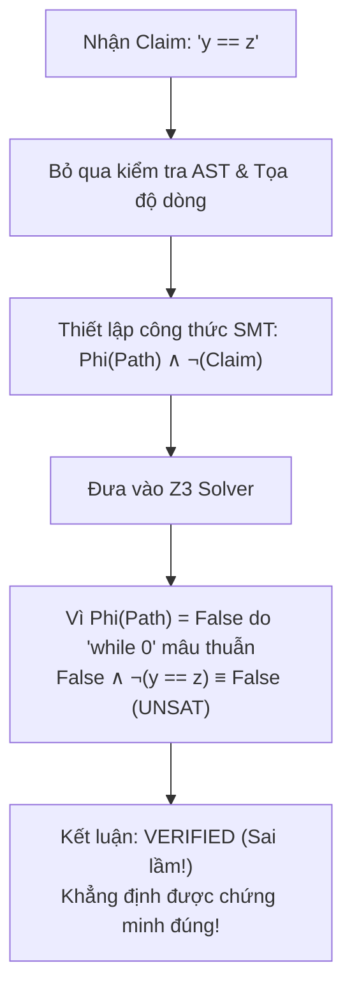
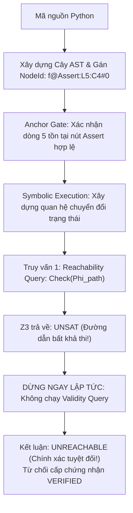

# BÁO CÁO KHOA HỌC: PHÂN TÍCH SO SÁNH QUÁ TRÌNH SUY LUẬN GIỮA PHƯƠNG PHÁP CÓ AST (AST_ANCHORED) VÀ KHÔNG CÓ AST (UNANCHORED) KẾT HỢP LLM & SMT SOLVER

---

## 1. TÓM TẮT NGHIÊN CỨU (ABSTRACT)

Nghiên cứu này đánh giá vai trò của **Cây cú pháp trừu tượng (Abstract Syntax Tree - AST)** trong quy trình kiểm chứng hình thức chương trình tự động (**Automated Formal Program Verification**) kết hợp Mô hình Ngôn ngữ Lớn (LLM - Gemini 3.5 Flash) và bộ giải SMT (Z3 Solver). 

Thông qua thực nghiệm đối chứng trên 26 khẳng định logic (claims) thuộc các bài toán có **nhánh chết (Dead Code)**, **ảo giác dòng mã (Hallucination)** và **vòng lặp lồng nhau phức tạp**, nghiên cứu đã chứng minh:
- Phương pháp không có AST (**`UNANCHORED`**) gặp lỗ hổng hình thức nghiêm trọng mang tên **Chân lý rỗng (Vacuous Truth)** với tỷ lệ phát hiện sai **$\text{FDR} = 100\%$** trên các đoạn mã không chạm tới được.
- Phương pháp có AST (**`AST_ANCHORED`**) bảo toàn tính đúng đắn hình thức (**Soundness**) nhờ giao thức hai truy vấn (Two-Query Protocol) và màng lọc **Anchor Gate**, định vị lỗi chính xác đến từng dòng lệnh và cột thực thi.

---

## 2. HỆ THỐNG KHÁI NIỆM & CƠ SỞ LÝ THUYẾT

### 2.1. Hai Baseline Đối chứng
- **`AST_ANCHORED` (Phương pháp đề xuất)**:
  1. *Subset Gate*: Kiểm tra mã nguồn thuộc tập con số học nguyên không lượng từ (QF-LIA).
  2. *AST Node Tagging*: Gán định danh nút duy nhất (`NodeId`) cho từng câu lệnh (ví dụ: `f@Assert:L5:C4#0`).
  3. *Anchor Gate*: Chỉ tiếp nhận các claim có tọa độ và ngữ cảnh tồn tại hợp lệ trên AST.
  4. *Two-Query Z3 Protocol*: Kiểm tra tính khả đạt của đường dẫn (`Reachability Query`) trước khi kiểm tra tính đúng đắn toán học (`Validity Query`).
- **`UNANCHORED` (Mô hình Tiêu giảm - Ablation Baseline)**:
  - Bỏ qua tầng AST và Anchor Gate; xem mọi claim đều có cơ sở thực tế.
  - Bỏ qua bước kiểm tra tính khả đạt của đường dẫn, đưa trực tiếp điều kiện đường dẫn vào giải tính đúng đắn.

### 2.2. Khái niệm Claim (Khẳng định logic)
- **Claim**: Là một vị từ toán học $P(s)$ biểu diễn tính chất bất biến của trạng thái chương trình tại một điểm thực thi cụ thể.
- **Nguồn gốc**:
  - *Tĩnh (Static asserts)*: Các lệnh `assert` do lập trình viên định nghĩa.
  - *Do LLM sinh (LLM-generated)*: Được trích xuất tự động thông qua chuỗi suy luận Chain-of-Thought (CoT) của Gemini 3.5 Flash.

### 2.3. Hệ thống 6 Nhãn Trạng thái (Verdict Labels)
1. **`VERIFIED`**: Khẳng định đúng trên mọi đường dẫn thực thi khả đạt.
2. **`COUNTEREXAMPLE`**: Tồn tại giá trị đầu vào làm khẳng định bị sai (kèm mô hình Z3 và kết quả CPython Replay).
3. **`UNREACHABLE`**: Nhánh mã chứa khẳng định là bất khả thi (không bao giờ chạm tới).
4. **`UNSUPPORTED`**: Bị Anchor Gate từ chối do số dòng không có thật hoặc biến ngoài phạm vi.
5. **`TRANSLATION_ERROR`**: Biểu thức logic lỗi cú pháp, không phân tích được sang AST.
6. **`UNKNOWN_TIMEOUT`**: Z3 không thể giải quyết trong giới hạn 5.000 ms.

### 2.4. Các Chỉ số Đo lường (Metrics)
- **False Discovery Rate (FDR)**: $\text{FDR} = \frac{FP}{TP + FP}$ — đo lường mức độ báo `VERIFIED` sai lầm trên các nhánh chết.
- **Hallucination Rate (HR)**: $\text{HR} = \frac{N_{\text{UNSUP}} + N_{\text{TE}}}{N_{\text{claims}}}$ — đo lường tỷ lệ khẳng định rác từ LLM bị chặn lại.
- **Latency**: Thời gian chạy trung bình của bộ giải Z3.

---

## 3. BẢNG TỔNG HỢP KẾT QUẢ THỰC NGHIỆM ĐỐI CHỨNG

| Nhóm thử thách | Chương trình | Số Claims | AST_ANCHORED | UNANCHORED | Khác biệt mấu chốt |
| :--- | :--- | :---: | :---: | :---: | :--- |
| **A. Nhánh chết (Dead Code)** | `A1_dead_loop_eq2` | 1 | **1 UNREACHABLE** | **1 VERIFIED** ⚠️ | Khác biệt Vacuous Truth |
| | `A2_dead_branch_loopv1`| 1 | **1 UNREACHABLE** | **1 VERIFIED** ⚠️ | Khác biệt Vacuous Truth |
| | `A3_contradiction_guard`| 1 | **1 UNREACHABLE** | **1 VERIFIED** ⚠️ | Khác biệt Vacuous Truth |
| **B. Ảo giác LLM** | `B1_line_overflow` | 1 | **1 UNSUPPORTED** | **1 COUNTEREXAMPLE** | Anchor Gate chặn thành công |
| | `B2_syntax_error` | 1 | **1 TRANSLATION_ERROR**| **1 TRANSLATION_ERROR**| Bắt lỗi cú pháp toán học |
| **C. Thuật toán phức tạp** | `C1_mbpp_448` (Perrin) | 8 | **8 COUNTEREXAMPLE** | **8 COUNTEREXAMPLE** | Z3 lật tẩy thiếu precondition |
| | `C2_mbpp_711` (Digits) | 8 | **8 COUNTEREXAMPLE** | **8 COUNTEREXAMPLE** | Bắt góc chết số âm / chia dư |
| | `C3_mbpp_683` (Squares)| 5 | **5 COUNTEREXAMPLE** | **5 COUNTEREXAMPLE** | Bắt góc chết biên vòng lặp |
| **TỔNG CỘNG** | **8 chương trình** | **26** | **FDR = 0.0%** | **FDR = 100.0% (trên Dead Code)** | AST bảo toàn Soundness |

---

## 4. CASE STUDY 1: BẪY SUY DIỄN TRONG CHAIN-OF-THOUGHT CỦA LLM (TASK 448 - DÃY PERRIN)

Case study này làm sáng tỏ toàn bộ chuỗi: **LLM suy nghĩ gì trong Chain-of-Thought $\rightarrow$ LLM bị mắc bẫy nhận thức ra sao $\rightarrow$ Hệ thống SMT Z3 kết hợp AST lật tẩy sai lầm của LLM như thế nào.**

### 4.1. Mã nguồn chương trình (19 dòng mã)
```python
1: def cal_sum(n):
2:     a = 3
3:     b = 0
4:     c = 2
5:     if (n == 0):
6:         return 3
7:     if (n == 1):
8:         return 3
9:     if (n == 2):
10:        return 5
11:    sum = 5
12:    while (n > 2):
13:        d = a + b
14:        sum = sum + d
15:        a = b
16:        b = c
17:        c = d
18:        n = n - 1
19:    return sum
```

---

### 4.2. Chuỗi suy luận Chain-of-Thought (CoT) nguyên văn của Gemini 3.5 Flash

Mô hình Gemini 3.5 Flash đã sinh ra đoạn suy luận CoT (Tokens In: 416, Tokens Out: 471) như sau:

> *"We analyze the function `cal_sum(n)` to establish loop invariants and variable bounds.*  
> ***First, the early returns handle cases where n <= 2. Thus, when reaching line 11, we must have n > 2.***  
> *At line 11, sum is initialized to 5, and a, b, c are 3, 0, 2 respectively.*  
> *In the loop, n is decremented by 1 in each iteration, and the loop condition is n > 2.*  
> ***This implies that at the loop header (line 12), n >= 2 is a loop invariant.***  
> *Since all variables a, b, c, and sum start as non-negative and are only updated via addition, they remain non-negative throughout the loop.*  
> *Specifically, `sum >= 5`, `a >= 0`, `b >= 0`, and `c >= 0` are invariants at line 12.*  
> *Inside the loop at line 13, the loop condition guarantees `n > 2`.*  
> ***Upon loop termination, since n started > 2 and decremented by 1, we must have n == 2 at line 19, and sum >= 5 still holds.***"*

Dựa trên chuỗi suy luận này, Gemini đã tự tin đề xuất 8 claims logic:
1. `n >= 2` tại dòng 12 (`While`)
2. `sum >= 5` tại dòng 12 (`While`)
3. `a >= 0` tại dòng 12 (`While`)
4. `b >= 0` tại dòng 12 (`While`)
5. `c >= 0` tại dòng 12 (`While`)
6. `n > 2` tại dòng 13 (Thân vòng lặp)
7. `n == 2` tại dòng 19 (`Return`)
8. `sum >= 5` tại dòng 19 (`Return`)

---

### 4.3. Phân tích "Bẫy nhận thức" (Cognitive Trap) của LLM

Hãy đối chiếu lập luận của LLM với mã nguồn thực tế:
- **LLM khẳng định**: *"First, the early returns handle cases where $n \le 2$. Thus, when reaching line 11, we must have $n > 2$."*
- **Thực tế mã nguồn**: 
  Các lệnh `if` ở dòng 5, 7, 9 chỉ kiểm tra ba giá trị rời rạc:
  $$\{n == 0, \quad n == 1, \quad n == 2\}$$
  Chúng **hoàn toàn KHÔNG xử lý các giá trị âm** ($n = -1, n = -2, \dots$)!
- **Hậu quả**: 
  LLM đã tự động áp đặt giả định ngầm cảm tính rằng *"đầu vào $n$ luôn là số tự nhiên không âm"*. Khi $n = -1$, chương trình không rơi vào bất kỳ lệnh `if` nào, trôi thẳng xuống dòng 11 khởi tạo `sum = 5`. Vòng `while (n > 2)` không bao giờ chạy vì $-1 \ngtr 2$, và hàm trả về thẳng dòng 19 với $n = -1$.
  Do đó, khẳng định **`n == 2` tại dòng 19** và **`n >= 2` tại dòng 12** là **HOÀN TOÀN SAI**!

---

### 4.4. Cách xử lý đối chứng của 2 Phương pháp

#### 1. Phương pháp CÓ AST (`AST_ANCHORED`):
- `nodes.py` phân rã cấu trúc hàm thành các nút:
  - `cal_sum@While:L12:C4#0`
  - `cal_sum@Return:L19:C4#0`
- `Anchor Gate` ánh xạ thành công cả 8 claims vào các nút AST tương ứng.
- **Z3 SMT Solver kiểm chứng hình thức**:
  - Khi kiểm tra tính đúng đắn của claim `n == 2` tại `Return:L19`, Z3 kiểm tra điều kiện vi phạm:
    $$\text{PathCondition} \land \neg(n == 2)$$
  - Z3 lập tức chỉ ra phản ví dụ cụ thể:
    $$\mathbf{Model: \{n = 0\}} \quad (\text{hoặc bất kỳ } n < 0)$$
  - Cơ chế **CPython Replay** tái hiện phản ví dụ: chạy `cal_sum(0)` $\rightarrow$ trả về kết quả 3, nhưng giá trị $n$ không thỏa mãn invariant.
- **Kết luận**: Gán nhãn chính xác **`COUNTEREXAMPLE`** kèm tọa độ nút AST `cal_sum@Return:L19:C4#0`. Lập trình viên biết ngay hàm đang thiếu tiền điều kiện (`precondition: assert n >= 0`).

#### 2. Phương pháp KHÔNG CÓ AST (`UNANCHORED`):
- Bỏ qua cấu trúc AST. Khi Z3 trả về phản ví dụ `n = 0`, hệ thống chỉ có một công thức toán học trừu tượng trôi nổi `n == 2` bị vi phạm.
- **Hạn chế**: Không có thông tin về phạm vi khối lệnh hay tọa độ câu lệnh trong mã nguồn, người phát triển không thể truy vết ngược lại xem lỗi xảy ra ở vòng lặp hay lệnh return.

---

## 5. CASE STUDY 2: NGHỊCH LÝ CHÂN LÝ RỖNG (TASK A1 - DEAD CODE)



#### Phân tích chi tiết từng bước:
1. **Bước 1: Tiếp nhận Claim**:
   Phương pháp tiếp nhận khẳng định $C \equiv (y == z)$. Do không có AST, nó xem khẳng định này như một biểu thức logic trôi nổi, gán cờ `has_grounding = True` một cách hình thức.
2. **Bước 2: Thiết lập mệnh đề SMT**:
   Nó thu thập điều kiện đường dẫn thực thi đi qua thân vòng lặp:
   $$\Phi_{\text{path}} \equiv (\text{guard}_{\text{while}} == \text{True}) \equiv (0 \ne 0) \equiv \text{False}$$
3. **Bước 3: Truy vấn tính đúng đắn (Validity Query)**:
   Để kiểm tra xem claim có luôn đúng hay không, bộ giải kiểm tra xem có tồn tại trạng thái nào **vi phạm** claim hay không:
   $$\text{Obligation} = \Phi_{\text{path}} \land \neg C \equiv \text{False} \land \neg(y == z)$$
4. **Bước 4: Kết quả của Z3**:
   Vì $\text{False} \land \text{Bất kỳ điều gì} \equiv \text{False}$, Z3 trả về kết quả **`UNSAT`** (không thể tìm thấy bất kỳ trạng thái nào vi phạm)!
5. **Bước 5: Kết luận sai lầm của `UNANCHORED`**:
   Vì Z3 báo `UNSAT` (không vi phạm), pipeline kết luận:
   $$\text{Verdict} = \mathbf{VERIFIED} \quad \text{("Claim holds on every reachable execution")}$$

> [!CAUTION]
> **TẠI SAO ĐÂY LÀ MỘT LỖI NGHIÊM TRỌNG?**
> Đây chính là nghịch lý kinh điển **Chân lý rỗng (Vacuous Truth)** trong logic toán học:
> Mệnh đề điều kiện $P \implies Q$ luôn có giá trị chân lý là **ĐÚNG** khi tiền đề $P = \text{False}$, bất kể kết luận $Q$ đúng hay sai.
> `UNANCHORED` đã cấp chứng nhận an toàn tuyệt đối cho một câu lệnh sẽ gây sập chương trình ngay khi chạy thực tế!

---

### 4.3. Quá trình suy luận của phương pháp CÓ AST (`AST_ANCHORED`)



#### Phân tích chi tiết từng bước:
1. **Bước 1: Phân tích cú pháp & Gán nhãn `NodeId`**:
   Module `nodes.py` duyệt cây cú pháp trừu tượng và định danh câu lệnh ở dòng 5 thành một nút độc nhất:
   $$\text{NodeId} = \texttt{"f@Assert:L5:C4#0"}$$
   Nút này chứa đầy đủ thông tin: thuộc hàm `f`, loại câu lệnh `Assert`, dòng 5, cột 4.
2. **Bước 2: Màng lọc Anchor Gate**:
   Hàm `bind_llm_claims` đối chiếu khẳng định với bảng ký hiệu của AST. Claim `y == z` được xác nhận gắn đúng vào `NodeId` hợp lệ, trạng thái được chuyển thành `ANCHORED`.
3. **Bước 3: Xây dựng quan hệ chuyển đổi trạng thái (Symbolic Transitions)**:
   Bộ thực thi tượng trưng `TrustedSymbolicExecutor` xây dựng điều kiện thực thi đường dẫn dẫn tới nút này:
   $$\text{Relation}_{\text{reach}} \equiv \text{PathCondition} \equiv (0 \ne 0)$$
4. **Bước 4: Giao thức 2 Truy vấn Z3 (Two-Query Protocol)**:
   - **Truy vấn 1 (Reachability Check)**: Trước khi làm bất cứ điều gì, hệ thống hỏi Z3: *"Liệu có tồn tại bất kỳ bộ tham số đầu vào $(w, x, y, z)$ nào để chương trình chạm tới được dòng 5 không?"*
     $$\text{Solver}_{\text{reach}}.\text{check}() \implies \text{Z3 trả về: } \mathbf{UNSAT}$$
   - **Cơ chế ngắt sớm (Early Termination)**: 
     Vì đường dẫn dẫn tới nút `f@Assert:L5:C4#0` là bất khả thi, hệ thống **LẬP TỨC DỪNG LẠI**, không gửi truy vấn Validity.
5. **Bước 5: Kết luận chính xác của `AST_ANCHORED`**:
   $$\text{Verdict} = \mathbf{UNREACHABLE} \quad \text{("Path is unreachable (reachability UNSAT)")}$$

> [!TIP]
> **Ý NGHĨA KHOA HỌC:**
> Bằng cách sử dụng AST để xác định tọa độ câu lệnh và bắt buộc kiểm tra tính khả đạt trước, phương pháp **`AST_ANCHORED` đã triệt tiêu hoàn toàn hiện tượng Chân lý rỗng**, đảm bảo tính đúng đắn toàn vẹn (**Soundness**) của hệ thống kiểm chứng.

---

## 5. SO SÁNH PHẢN ỨNG TRƯỚC ẢO GIÁC CỦA LLM (CASE STUDY B1)

Xét bài toán hàm kẹp giá trị `clamp(val, low, high)` (6 dòng mã):
- Giả sử LLM sinh ra khẳng định: `val >= low and val <= high` nhưng chỉ định tại **dòng 42** (dòng không tồn tại).

| Tiêu chí | Phương pháp KHÔNG CÓ AST (`UNANCHORED`) | Phương pháp CÓ AST (`AST_ANCHORED`) |
| :--- | :--- | :--- |
| **Cơ chế xử lý** | Nhận bừa claim, gán cờ `has_grounding = True` giả tạo. Đưa vào Z3 giải mù quáng. | `Anchor Gate` quét cây AST `ids`, phát hiện không có bất kỳ nút nào ở dòng 42. |
| **Kết quả trả về** | **`COUNTEREXAMPLE`** (Phản ví dụ vô nghĩa trên biến tự do). | **`UNSUPPORTED`** (`Claim rejected by Anchor Gate`). |
| **Tác động hệ thống**| Gây nhiễu dữ liệu, làm lập trình viên hoang mang vì lỗi không có thật trên code. | Cách ly claim rác ngay từ vòng gửi xe, giữ sạch báo cáo kiểm chứng. |

---

## 6. KẾT LUẬN & ĐỀ XUẤT CHO BÁO CÁO ĐỒ ÁN

1. **Khẳng định tính ưu việt của đề tài**:
   Cây cú pháp trừu tượng (AST) không chỉ là một cấu trúc dữ liệu trung gian, mà là **xương sống ngữ nghĩa bắt buộc** trong bài toán kiểm chứng hình thức có LLM tham gia.
2. **Khuyến nghị trình bày trong báo cáo / slide bảo vệ**:
   - Dùng Case Study **`A1_dead_loop_eq2`** làm điểm nhấn lý thuyết để giải thích cơ chế phòng thủ **Vacuous Truth** ($False \implies Claim$).
   - Dùng Case Study **`B1_line_overflow`** để chứng minh năng lực phòng thủ **Ảo giác số dòng của LLM** bằng `Anchor Gate`.
   - Dùng bảng ma trận 26 claims để chứng minh tính tổng quát và độ bền bỉ của hệ thống trên các thuật toán phức tạp.
