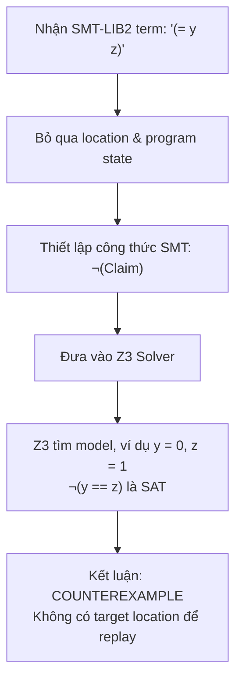
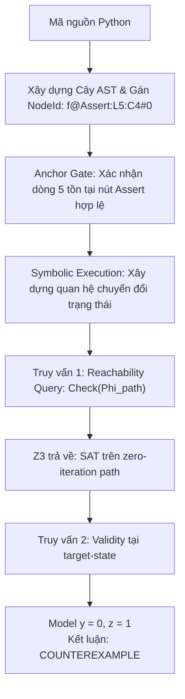

# BÁO CÁO KHOA HỌC: PHÂN TÍCH SO SÁNH QUÁ TRÌNH SUY LUẬN GIỮA PHƯƠNG PHÁP CÓ AST (AST_ANCHORED) VÀ KHÔNG CÓ AST (UNANCHORED) KẾT HỢP LLM & SMT SOLVER

> **Audit correction.** Các bảng trong tài liệu này ghi lại lần chạy cũ.
> `UNANCHORED` không phải pipeline AST rút gọn: nó là Baseline A Direct
> Formalization, nhận Boolean terms SMT-LIB2 độc lập và không có anchor,
> target location, program state, reachability hoặc replay.
> Các loop/`break`/`continue` chưa tạo thành coverage toàn bộ; kết quả hiện
> tại sẽ dùng `UNKNOWN_TIMEOUT` khi bounded path set không hoàn chỉnh. Token
> LLM của hai baseline được sinh từ hai lời gọi riêng và token totals được ghi
> độc lập.

---

## 1. TÓM TẮT NGHIÊN CỨU (ABSTRACT)

Nghiên cứu này đánh giá vai trò của **Cây cú pháp trừu tượng (Abstract Syntax Tree - AST)** trong quy trình kiểm chứng hình thức chương trình tự động (**Automated Formal Program Verification**) kết hợp Mô hình Ngôn ngữ Lớn (LLM - Gemini 3.5 Flash) và bộ giải SMT (Z3 Solver). 

Các bảng bên dưới là tư liệu lịch sử của commit cũ. Chúng không đủ để
chứng minh soundness toàn chương trình: mô hình loop/control-flow là bounded,
replay phải chạm đúng target, và số liệu cũ đã chạy một baseline hybrid.
Mã hiện tại chỉ hỗ trợ kết luận hẹp hơn: `AST_ANCHORED` kiểm tra anchor chính
xác, target-state reachability và validity; `UNANCHORED` kiểm tra trực tiếp
SMT-LIB2 QF-LIA terms bằng `not C`, không dùng program state hay vị trí thực
thi.

---

## 2. HỆ THỐNG KHÁI NIỆM & CƠ SỞ LÝ THUYẾT

### 2.1. Hai Baseline Đối chứng
- **`AST_ANCHORED` (Phương pháp đề xuất)**:
  1. *Subset Gate*: Kiểm tra mã nguồn thuộc tập con số học nguyên không lượng từ (QF-LIA).
  2. *AST Node Tagging*: Gán định danh nút duy nhất (`NodeId`) cho từng câu lệnh (ví dụ: `f@Assert:L5:C4#0`).
  3. *Anchor Gate*: Chỉ tiếp nhận các claim có tọa độ và ngữ cảnh tồn tại hợp lệ trên AST.
  4. *Two-Query Z3 Protocol*: Kiểm tra tính khả đạt của đường dẫn (`Reachability Query`) trước khi kiểm tra tính đúng đắn toán học (`Validity Query`).
- **`UNANCHORED` (Baseline A — Direct Formalization)**:
  - Không gán `NodeId`, không dựng symbolic executor và không dùng Anchor Gate.
  - Sau subset gate, source assert được chuyển một lần thành SMT-LIB2; các
    specification từ lời gọi LLM riêng được append và kiểm tra bằng `not C`.
    Location, program state và reachability bị loại khỏi obligation.

### 2.2. Khái niệm Claim (Khẳng định logic)
- **Claim**: Là một vị từ toán học $P(s)$ biểu diễn tính chất bất biến của trạng thái chương trình tại một điểm thực thi cụ thể.
- **Nguồn gốc**:
  - *Tĩnh (Static asserts)*: Các lệnh `assert` do lập trình viên định nghĩa.
  - *AST_ANCHORED do LLM sinh*: được trích xuất tự động qua prompt
    Chain-of-Thought (CoT) của Gemini 3.5 Flash.
  - *UNANCHORED do LLM sinh*: được tạo bởi lời gọi độc lập dưới dạng
    SMT-LIB2 Boolean terms và rationale ngắn, không yêu cầu CoT.

### 2.3. Hệ thống 6 Nhãn Trạng thái (Verdict Labels)
1. **`VERIFIED`**: Khẳng định đúng trên mọi đường dẫn được mô hình hóa đầy đủ tới target; không phải chứng nhận cho mọi execution khi coverage bounded.
2. **`COUNTEREXAMPLE`**: Z3 tìm thấy mô hình vi phạm; replay chỉ được xem là xác nhận khi runtime chạm target và claim sai tại đó.
3. **`UNREACHABLE`**: Nhánh mã chứa khẳng định là bất khả thi (không bao giờ chạm tới).
4. **`UNSUPPORTED`**: Bị Anchor Gate từ chối do số dòng không có thật hoặc biến ngoài phạm vi.
5. **`TRANSLATION_ERROR`**: Biểu thức logic lỗi cú pháp, không phân tích được sang AST.
6. **`UNKNOWN_TIMEOUT`**: Z3 không thể giải quyết trong giới hạn 5.000 ms.

### 2.4. Các Chỉ số Đo lường (Metrics)
- **False Discovery Rate (FDR)**: $\text{FDR} = \frac{FP}{TP + FP}$ — đo lường mức độ báo `VERIFIED` sai lầm trên các nhánh chết.
- **Hallucination Rate (HR)**: $\text{HR} = \frac{N_{\text{UNSUP}} + N_{\text{TE}}}{N_{\text{claims}}}$ — đo lường tỷ lệ khẳng định rác từ LLM bị chặn lại.
- **Latency**: Thời gian chạy trung bình của bộ giải Z3.

---

## 3. BẢNG TỔNG HỢP KẾT QUẢ THỰC NGHIỆM ĐỐI CHỨNG

> **Lưu ý về provenance:** các verdict trong bảng này là output lịch sử của
> pipeline hybrid ở commit cũ. Chúng được giữ lại để đối chiếu, không phải
> kết quả của baseline hiện tại. Đặc biệt, A1 có assertion sau vòng `while 0`,
> nên target vẫn reachable qua zero-iteration path; nó không phải một target
> unreachable.

| Nhóm thử thách | Chương trình | Số Claims | AST_ANCHORED | UNANCHORED | Khác biệt mấu chốt |
| :--- | :--- | :---: | :---: | :---: | :--- |
| **A. Nhánh chết (Dead Code)** | `A1_dead_loop_eq2` | 1 | old: UNREACHABLE; current: **COUNTEREXAMPLE** | old: VERIFIED; current: **COUNTEREXAMPLE** | Assertion sau loop reachable qua skip path |
| | `A2_dead_branch_loopv1`| 1 | old: UNREACHABLE; current: **COUNTEREXAMPLE** | old: VERIFIED; current: **COUNTEREXAMPLE** | Target-specific paths |
| | `A3_contradiction_guard`| 1 | old: UNREACHABLE; current: **UNREACHABLE** | old: VERIFIED; current: **COUNTEREXAMPLE** | Direct term không thấy guard |
| **B. Ảo giác LLM** | `B1_line_overflow` | 1 | **1 UNSUPPORTED** | **1 COUNTEREXAMPLE** | Anchor Gate chặn thành công |
| | `B2_syntax_error` | 1 | **1 TRANSLATION_ERROR**| **1 TRANSLATION_ERROR**| Bắt lỗi cú pháp toán học |
| **C. Thuật toán phức tạp** | `C1_mbpp_448` (Perrin) | 8 | historical: 8 COUNTEREXAMPLE | historical: 8 COUNTEREXAMPLE | Lần chạy cũ |
| | `C2_mbpp_711` (Digits) | 8 | historical: 8 COUNTEREXAMPLE | historical: 8 COUNTEREXAMPLE | Lần chạy cũ |
| | `C3_mbpp_683` (Squares)| 5 | historical: 5 COUNTEREXAMPLE | historical: 5 COUNTEREXAMPLE | Lần chạy cũ |
| **TỔNG CỘNG** | **8 chương trình** | **26** | historical FDR = 0.0% | historical FDR = 100.0% trên dead-code cases | Không phải kết luận hiện tại |

---

## 4. CASE STUDY 1: BẪY SUY DIỄN TRONG CHAIN-OF-THOUGHT CỦA LLM (TASK 448 - DÃY PERRIN)

Case study này làm sáng tỏ toàn bộ chuỗi: **LLM suy nghĩ gì trong Chain-of-Thought $\rightarrow$ LLM bị mắc bẫy nhận thức ra sao $\rightarrow$ Hệ thống SMT Z3 kết hợp AST lật tẩy sai lầm của LLM như thế nào.**

### 4.1. Mã nguồn chương trình (19 dòng mã)
```python
1: def cal_sum(n):
2:     a = 3
3:     b = 0
4:     c = 2
5:     if (n == 0):
6:         return 3
7:     if (n == 1):
8:         return 3
9:     if (n == 2):
10:        return 5
11:    sum = 5
12:    while (n > 2):
13:        d = a + b
14:        sum = sum + d
15:        a = b
16:        b = c
17:        c = d
18:        n = n - 1
19:    return sum
```

---

### 4.2. Chuỗi suy luận Chain-of-Thought (CoT) nguyên văn của Gemini 3.5 Flash

Mô hình Gemini 3.5 Flash đã sinh ra đoạn suy luận CoT (Tokens In: 416, Tokens Out: 471) như sau:

> *"We analyze the function `cal_sum(n)` to establish loop invariants and variable bounds.*  
> ***First, the early returns handle cases where n <= 2. Thus, when reaching line 11, we must have n > 2.***  
> *At line 11, sum is initialized to 5, and a, b, c are 3, 0, 2 respectively.*  
> *In the loop, n is decremented by 1 in each iteration, and the loop condition is n > 2.*  
> ***This implies that at the loop header (line 12), n >= 2 is a loop invariant.***  
> *Since all variables a, b, c, and sum start as non-negative and are only updated via addition, they remain non-negative throughout the loop.*  
> *Specifically, `sum >= 5`, `a >= 0`, `b >= 0`, and `c >= 0` are invariants at line 12.*  
> *Inside the loop at line 13, the loop condition guarantees `n > 2`.*  
> ***Upon loop termination, since n started > 2 and decremented by 1, we must have n == 2 at line 19, and sum >= 5 still holds.***"*

Dựa trên chuỗi suy luận này, Gemini đã tự tin đề xuất 8 claims logic:
1. `n >= 2` tại dòng 12 (`While`)
2. `sum >= 5` tại dòng 12 (`While`)
3. `a >= 0` tại dòng 12 (`While`)
4. `b >= 0` tại dòng 12 (`While`)
5. `c >= 0` tại dòng 12 (`While`)
6. `n > 2` tại dòng 13 (Thân vòng lặp)
7. `n == 2` tại dòng 19 (`Return`)
8. `sum >= 5` tại dòng 19 (`Return`)

---

### 4.3. Phân tích "Bẫy nhận thức" (Cognitive Trap) của LLM

Hãy đối chiếu lập luận của LLM với mã nguồn thực tế:
- **LLM khẳng định**: *"First, the early returns handle cases where $n \le 2$. Thus, when reaching line 11, we must have $n > 2$."*
- **Thực tế mã nguồn**: 
  Các lệnh `if` ở dòng 5, 7, 9 chỉ kiểm tra ba giá trị rời rạc:
  $$\{n == 0, \quad n == 1, \quad n == 2\}$$
  Chúng **hoàn toàn KHÔNG xử lý các giá trị âm** ($n = -1, n = -2, \dots$)!
- **Hậu quả**: 
  LLM đã tự động áp đặt giả định ngầm cảm tính rằng *"đầu vào $n$ luôn là số tự nhiên không âm"*. Khi $n = -1$, chương trình không rơi vào bất kỳ lệnh `if` nào, trôi thẳng xuống dòng 11 khởi tạo `sum = 5`. Vòng `while (n > 2)` không bao giờ chạy vì $-1 \ngtr 2$, và hàm trả về thẳng dòng 19 với $n = -1$.
  Do đó, khẳng định **`n == 2` tại dòng 19** và **`n >= 2` tại dòng 12** là **HOÀN TOÀN SAI**!

---

### 4.4. Cách xử lý đối chứng của 2 Phương pháp

#### 1. Phương pháp CÓ AST (`AST_ANCHORED`):
- `nodes.py` phân rã cấu trúc hàm thành các nút:
  - `cal_sum@While:L12:C4#0`
  - `cal_sum@Return:L19:C4#0`
- `Anchor Gate` ánh xạ thành công cả 8 claims vào các nút AST tương ứng.
- **Z3 SMT Solver kiểm chứng hình thức**:
  - Khi kiểm tra tính đúng đắn của claim `n == 2` tại `Return:L19`, Z3 kiểm tra target-state relation cùng điều kiện vi phạm:
    $$R_\pi(s_0,s) \land \neg(n == 2)$$
  - Z3 lập tức chỉ ra phản ví dụ cụ thể:
    $$\mathbf{Model: \{n = -1\}}$$
  - Cơ chế **CPython Replay** chỉ có thể xác nhận phản ví dụ nếu chạy `cal_sum(-1)` tới đúng dòng 19; các early return như `cal_sum(0)` không chạm target đó.
- **Kết luận**: Gán nhãn chính xác **`COUNTEREXAMPLE`** kèm tọa độ nút AST `cal_sum@Return:L19:C4#0`. Lập trình viên biết ngay hàm đang thiếu tiền điều kiện (`precondition: assert n >= 0`).

#### 2. Phương pháp `UNANCHORED`:
- Baseline A kiểm tra trực tiếp term SMT-LIB2 `(= n 2)` trên các biến Int đã khai báo.
- Z3 có thể trả về phản ví dụ như `n = 0`, nhưng kết quả không gắn với execution point nào và không được replay như violation tại dòng 19.

---

## 5. CASE STUDY 2: NGHỊCH LÝ CHÂN LÝ RỖNG (TASK A1 - DEAD CODE)



#### Phân tích chi tiết từng bước:
1. **Bước 1: Tiếp nhận direct term**: `UNANCHORED` giữ lại SMT-LIB2 `(= y z)`, nhưng loại bỏ dòng, node và state của chương trình.
2. **Bước 2: Truy vấn validity**: obligation là $\neg(y == z)$ trên các biến nguyên tự do, không phải $\Phi_{\text{path}} \land \neg C$.
3. **Bước 3: Kết quả từ Z3**: công thức có model, chẳng hạn $y = 0, z = 1$.
4. **Bước 4: Kết luận**: verdict là **`COUNTEREXAMPLE`** cho direct formula; không thể suy ra claim bị sai tại dòng 5 của chương trình.

> [!CAUTION]
> **Giới hạn của ví dụ:** direct formula không chứa đủ thông tin để nói
> assertion ở dòng 5 reachable hay unreachable. Việc bỏ path context loại bỏ
> vacuity, nhưng cũng loại bỏ khả năng kiểm chứng property tại location.

---

### 4.3. Quá trình suy luận của phương pháp CÓ AST (`AST_ANCHORED`)



#### Phân tích chi tiết từng bước:
1. **Bước 1: Phân tích cú pháp & Gán nhãn `NodeId`**:
   Module `nodes.py` duyệt cây cú pháp trừu tượng và định danh câu lệnh ở dòng 5 thành một nút độc nhất:
   $$\text{NodeId} = \texttt{"f@Assert:L5:C4#0"}$$
   Nút này chứa đầy đủ thông tin: thuộc hàm `f`, loại câu lệnh `Assert`, dòng 5, cột 4.
2. **Bước 2: Màng lọc Anchor Gate**:
   Hàm `bind_llm_claims` đối chiếu khẳng định với bảng ký hiệu của AST. Claim `y == z` được xác nhận gắn đúng vào `NodeId` hợp lệ, trạng thái được chuyển thành `ANCHORED`.
3. **Bước 3: Xây dựng quan hệ chuyển đổi trạng thái (Symbolic Transitions)**:
   `TrustedSymbolicExecutor` enumerates zero-iteration and body paths. Với
   assertion sau vòng lặp, zero-iteration path có guard khả đạt và state tại
   target giữ nguyên các tham số `y`, `z`; relation cũng chứa state equations.
4. **Bước 4: Giao thức 2 Truy vấn Z3 (Two-Query Protocol)**:
   - **Truy vấn 1 (Reachability Check)**: hỏi liệu có input nào đi tới
     `f@Assert:L5:C4#0` qua zero-iteration path hay không. Câu trả lời là
     `SAT` vì `while 0` có thể được bỏ qua.
   - **Truy vấn 2 (Validity Check)**: kiểm tra relation của target-state cùng
     với $\neg(y == z)$; model `y = 0, z = 1` là một vi phạm khả thi.
5. **Bước 5: Kết luận chính xác của `AST_ANCHORED`**:
   $$\text{Verdict} = \mathbf{COUNTEREXAMPLE}$$

> [!TIP]
> **Ý NGHĨA KHOA HỌC:**
> `AST_ANCHORED` tránh kết luận từ một path bất khả đạt bằng cách chạy
> reachability riêng cho target. Tuy nhiên, đây vẫn là bounded analysis; chỉ
> các target path được mô hình hóa đầy đủ mới được phép nhận `VERIFIED`.

---

## 5. SO SÁNH PHẢN ỨNG TRƯỚC ẢO GIÁC CỦA LLM (CASE STUDY B1)

Xét bài toán hàm kẹp giá trị `clamp(val, low, high)` (6 dòng mã):
- Giả sử LLM sinh ra khẳng định: `val >= low and val <= high` nhưng chỉ định tại **dòng 42** (dòng không tồn tại).

| Tiêu chí | Phương pháp KHÔNG CÓ AST (`UNANCHORED`) | Phương pháp CÓ AST (`AST_ANCHORED`) |
| :--- | :--- | :--- |
| **Cơ chế xử lý** | Nhận SMT-LIB2 term và kiểm tra `not C` trên các biến Int, không có location để đối chiếu. | `Anchor Gate` quét cây AST `ids`, phát hiện không có bất kỳ nút nào ở dòng 42. |
| **Kết quả trả về** | **`COUNTEREXAMPLE`** (Phản ví dụ vô nghĩa trên biến tự do). | **`UNSUPPORTED`** (`Claim rejected by Anchor Gate`). |
| **Tác động hệ thống**| Gây nhiễu dữ liệu, làm lập trình viên hoang mang vì lỗi không có thật trên code. | Cách ly claim rác ngay từ vòng gửi xe, giữ sạch báo cáo kiểm chứng. |

---

## 6. KẾT LUẬN & ĐỀ XUẤT CHO BÁO CÁO ĐỒ ÁN

1. **Khẳng định có thể bảo vệ được**:
   AST cung cấp anchor, target state và reachability context mà direct term
   không thể cung cấp. Đây là lợi ích về traceability và semantics, không phải
   bằng chứng soundness toàn chương trình.
2. **Khuyến nghị trình bày trong báo cáo / slide bảo vệ**:
   - Dùng Case Study **`A1_dead_loop_eq2`** để minh họa zero-iteration path và sự khác nhau giữa target reachable với loop body dead.
   - Dùng một assertion nằm bên trong `while 0` hoặc guard mâu thuẫn để minh họa verdict `UNREACHABLE`.
   - Dùng Case Study **`B1_line_overflow`** để chứng minh năng lực phòng thủ **Ảo giác số dòng của LLM** bằng `Anchor Gate`.
   - Ghi rõ bảng ma trận 26 claims là output lịch sử, không dùng nó để chứng minh tính tổng quát hoặc soundness.
